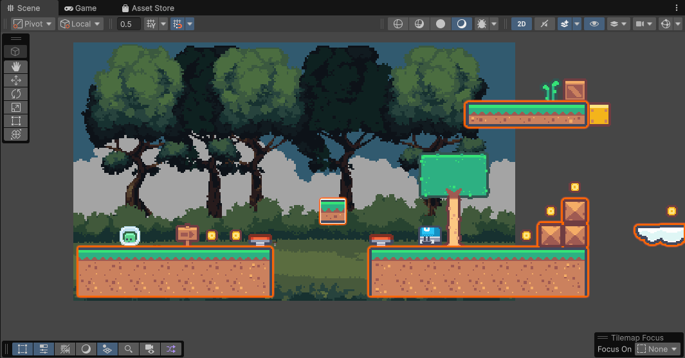

# Prototipo 2D
# Fundamentos del Desarrollo de Videojuegos
# Ginés Cruz Chávez

## El juego

Eres un alienígena que acaba de aterrizar en un mundo lleno de sorpresas: monedas, resortes y enemigos te esperan en este nivel de plataformas 2D. Tu meta es recolectar todas las monedas y superar todos los saltos para llegar hasta el final y recoger la bandera. Sin embargo, solo tienes tres vidas, y si las pierdes todas deberás empezar de nuevo.

## Parallax

Para dar profundidad al fondo se ha empleado un efecto de desplazamiento parallax con 4 capas. Utilizando un Quad que contiene 4 materiales transparentes (un material por capa), se calcula el offset de la textura de cada una de estas capas utilizando la posición de la cámara.

Script: [ParallaxBackground.cs](Assets/Scripts/Effects/ParallaxBackground.cs)

## Físicas

A lo largo del nivel podrás encontrar varias cajas que actúan como objetos físicos (Rigidbody2D) que pueden interactuar con el personaje. Para aplicar los Joints 2D, se ha integrado una sección en la que el jugador deberá accionar una palanca para liberar las cajas de las cuerdas a las que están atadas. La unión de los cuerpos físicos se ha hecho con FixedJoint2D para conectar la caja a la cuerda, y HingeJoint2D para conectar las cuerdas entre sí.

Script: [Lever.cs](Assets/Scripts/LevelEntities/Lever.cs) [RandomForce.cs](Assets/Scripts/RandomForce.cs)

También se han implementado plataformas móviles a las que el personaje se puede subir y ser transportado por ellas. Son un Rigidbody2D cinemático controlado por un script que interpola su posición entre dos puntos predefinidos.

Script: [MovingPlatform.cs](Assets/Scripts/LevelEntities/MovingPlatform.cs)

## Object Pooling

Para ahorrar carga de procesamiento a la hora de instanciar objetos, se ha utilizado la técnica de object pooling. El singleton **EffectsManager** permite instanciar estos efectos utilizando object pooling de manera cómoda. En el juego se observan los siguientes efectos de partículas:

1. Salto
2. Aterrizaje
3. Recolección de moneda
4. Muerte de enemigo

Script: [PoolObject.cs](Assets/Scripts/Effects/PoolObject.cs) [EffectsManager.cs](Assets/Scripts/Effects/EffectsManager.cs)

## Cinemachine

Se utiliza el paquete Cinemachine para el sistema de cámaras del juego. Existen tres cámaras diferentes en la escena:
1. **Cámara principal:** Está activa la mayor parte del tiempo, mantiene centrado al jugador y tiene una zona de confinamiento que cubre el nivel completo para no mostrar áreas exteriores.
2. **Cámara enfoque cajas:** Se activa al acercarse a la zona con las cajas y la palanca. Contiene un Target Group que sigue al centro de las cajas y al jugador (este último con menos peso), además está confinada por la misma zona que la cámara principal.
2. **Cámara enfoque final:** Se activa al acercarse a la bandera del final. Contiene un Target Group que sigue a la bandera y al jugador, además está confinada por la misma zona que la cámara principal.

Para realizar las transiciones entre cámaras existe un objeto CameraZone, que consiste de un Box Collider 2D trigger el cual activa una cámara cuando el jugador entra en la zona, y la desactiva una vez sale de ella.

Scripts: [CameraZone.cs](Assets/Scripts/Effects/CameraZone.cs)

Cuando el jugador acciona la palanca en la sección de las cajas, ocurre un efecto de "camera shake". Este se logra mediante un componente CinemachineImpulseListener en la cámara correspondiente a esa sección, y un CinemachineImpulseSource en la palanca que se activa con el evento de accionado.

Se han ajustado los tiempos de transiciones entre cámaras para que sean más rápidos utilizando el asset CinemachineBlenderSettings.

## Sonidos

El juego incorpora sonidos para saltar, usar el resorte, tocar el suelo, recolectar monedas, recibir daño, matar un enemigo, accionar una palanca y morir. Todos estos sonidos se reproducen con AudioSources configuradas para 2D, y se han elaborado utilizando la herramienta grauita [jsfxr](https://sfxr.me/). Los .wav utilizados en este proyecto se pueden encontrar en el directorio [Sounds](Assets/Sounds/).

## UI

Hay cuatro elementos de UI utilizados en el prototipo:

1. **Contador de monedas:** Muestra la cantidad de monedas que ha recolectado actualmente el jugador. Se suscribe al evento que disparan las monedas al ser recolectadas y actualiza el contador con una pequeña animación realizada con el plugin [DOTween](https://dotween.demigiant.com/). Si la moneda recogida tiene valor de más de uno, va incrementando gradualmente el contador hasta llegar al valor final.

2. **Vidas:** Muestra las vidas que tiene actualmente el jugador. Se suscribe al evento disparado por el componente PlayerHealth al recibir daño y actualiza la cantidad de corazones mostrados en pantalla.

3. **Pantalla de derrota:** Se hace visible cuando el jugador pierde todas sus vidas. Esta pantalla pausa la partida (poniendo el timeScale a 0) y espera a que el jugador pulse la tecla R para recargar la escena.

4. **Pantalla de victoria:** Se hace visible cuando el jugador entra en contacto con la bandera. Esta pantalla pausa la partida (poniendo el timeScale a 0) y espera a que el jugador pulse la tecla R para recargar la escena.

Se ha diseñado la interfaz y las pantallas para que sean lo más modular posible, utilizando delegados y eventos.

## Animaciones

Gran parte de objetos en la escena utilizan animaciones, como la palanca, los enemigos, las monedas y la bandera, pero se detallará el Animation Controller del jugador puesto que es el más complejo de todos.

La capa base (Base Layer) del animador contiene los 3 estados principales de movimiento: Idle (quieto), Walk (caminar) y Jump (saltar). Las transiciones se realizan con dos booleanos: Moving, que determina si el jugador se está moviendo, y Grounded, que determina si está en el suelo o en el aire.

La capa de Damage controla la animación de recibir daño. Cuando se dispara el trigger Hurt, pasa al estado Damage hasta que termine la animación, y luego permanece en estado NoDamage hasta que se vuelva a disparar el trigger. El resto de Animation Controllers siguen una estructura mucho más sencilla.

## Tilemap

La mayor parte de la escena se ha construido utilizando Tilemaps, salvo aquellos objetos que son interactivos o se pueden mover.
Para gestionar las colisiones y la decoración de la escena, se ha dividido en las siguientes capas:
1. **Ground:** La capa de suelo, tiene un Tilemap Collider 2D y un Composite Collider 2D. Es la única capa que puede navegar el jugador y los objetos físicos con seguridad.
2. **Decoration Front:** Objetos decorativos que están en frente del jugador, como las vallas de la sección de las cajas.
3. **Decoration Back:** Objetos decorativos que están detrás del jugador.
4. **Decoration Back 2:** Objetos decorativos que están detrás del jugador y detrás de los Decoration Back. De esta manera se pueden aprovechar las Tiles ya existentes para hacer una decoración más elaborada aprovechando las capas.
5. **Hurt:** Objetos sólidos pero que hacen daño al jugador, como pinchos. Tienen un componente que detectan colisiones con el jugador y le aplican daño constante.

## Eventos de juego

Cuando el jugador recolecta todas las monedas del nivel, la bandera aparecerá y podrá completar el juego. La clase Coin tiene un contador interno estático que almacena la cantidad de monedas activas en la escena. Al destruirse una moneda, este contador decrementará. La bandera está suscrita al evento de recolección de moneda y comprueba que el contador sea igual a cero, y si lo es, se activa.

Scripts: [EndFlag.cs](Assets/Scripts/LevelEntities/EndFlag.cs)